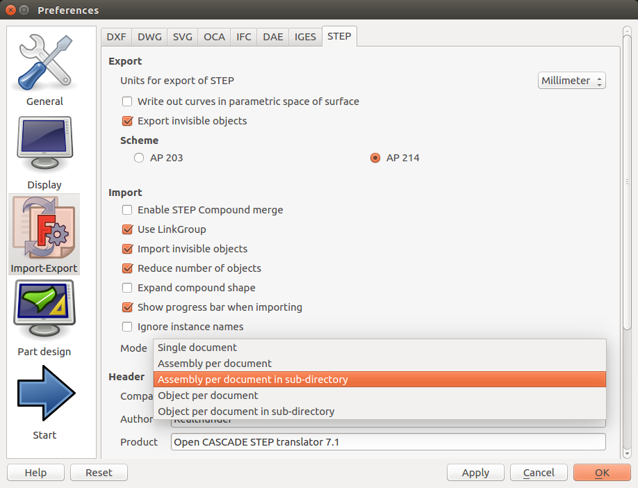

__New Feature__

* Support STEP import ,
  which imports STEP assembly into Assembly3 container(s). There is also another
  import option 
  to import multiple-level assembly into separate documents in their own
  directories. More multiple-document import settings are available through the
  STEP import preference page

  

  Check out demo [here](https://youtu.be/s4uZPmmaNCg)

* Support adding plain group 
  to further organizing assembly parts, elements and constraints. 

* Introduce the new `Attachment` 
  
  constraint based on the discussion of `Assembly without solver` [thread].
  This constraint completely fixed the relationship between two (or more)
  involved parts. This constraint can be solved easily without relying on
  the expansive algebra solver, if and only if the constraint contains any part
  that is either explicitly fixed by a `Lock` constraint
  ,
  or indirectly fixed through a chain of other `Attachment` constraints. If the condition is
  not satisfied, the constraint will be treated like a `Coincidence` constraint
  ,
  with locked angle and passed to the solved as usual.

* Add button 
  to toggle coordinate system visibility of an `Element`

__FreeCAD LinkStage3__

* Add support of plain group in `App::Link`. See demo [here](https://youtu.be/uEhlGxKmVfU).

* Multi-solid support in `PartDesign`. See demo [here](https://youtu.be/fH7h8pvAym8)

* Performance improvement in `PartDesign ` feature `Transform`.

* Support adding/removing properties (i.e. dynamic property) in all `DocumentObject` and `Document`.
  See demo [here](https://youtu.be/UCdJsQe-ZAI).

* Change tab window behavior for external linked document.

* Improve `Selection View` multi-element picking list feature.

* Support Copy/Move/Replace/Link action when drag and drop in tree view. See demo [here](https://youtu.be/f1raOT4thEM).

* Improve tree view and document loading performance.

* Improve auto transaction feature, i.e. better undo/redo. Every command will now setup a default transaction.

* Bundle [CadQuery](https://github.com/dcowden/cadquery) as `fc_cadquery`, and exposed to
  Expression as [pseudo property](Expression-and-Spreadsheet#user-content-pseudo-property) `_cq`.

* Support of using variable outside of function in extended expression syntax.

